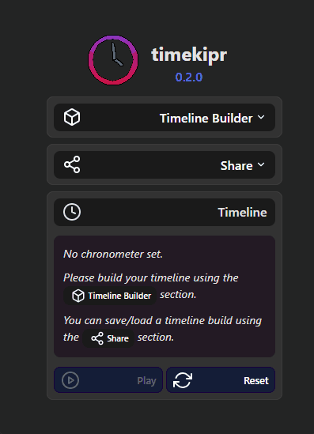

# timekipr

A simple time-keeper app for meetings.

<p align="center">
    
</p>

**:rocket: [Play with it here!](https://srynetix.github.io/timekipr/)**

## Features

- Manage a chronometer timeline, with optional alerts,
- Timeline configuration is persisted using a hash, shown in the address bar,
- When playing, a timeline will be saved and can be resumed at any time, if using the same timeline configuration (the same hash)

## Multiple applications

Using a monorepo (thanks to Turborepo), this repository contains three different applications:

- A standalone web application: [timekipr-web]
- A desktop application using [Tauri]: [timekipr-desktop]
- A [Microsoft Teams] meeting application / custom tab: [timekipr-teams]

## How to build

**Prerequisites:**

- [Node] 18+
- [Rust] (if building the desktop app)

### Build the webapp

```sh
npm install
npm run build:web
```

The webapp code will be in the `./apps/timekipr-web/dist` folder.
You can use `npm run serve:web` to run a simple server to access the app.

### Build the desktop app

The desktop app is made using [Tauri], so you will need [Rust].
Then run:

```sh
npm install
npm run build:desktop
```

The executable will be in the `./apps/timekipr-desktop/src-tauri/target/release` folder.

You will also generate installers for Windows:

- The installer MSI file will be in the folder `apps/timekipr-desktop/src-tauri/target/release/bundle/msi`
- The installer EXE file will be in the folder `apps/timekipr-desktop/src-tauri/target/release/bundle/nsis`

[Node]: https://nodejs.org/en
[Rust]: https://www.rust-lang.org/en
[Tauri]: https://tauri.app/
[timekipr-web]: ./apps/timekipr-web/
[timekipr-desktop]: ./apps/timekipr-desktop/
[timekipr-teams]: ./apps/timekipr-teams/
[Microsoft Teams]: https://www.microsoft.com/en-us/microsoft-teams/
